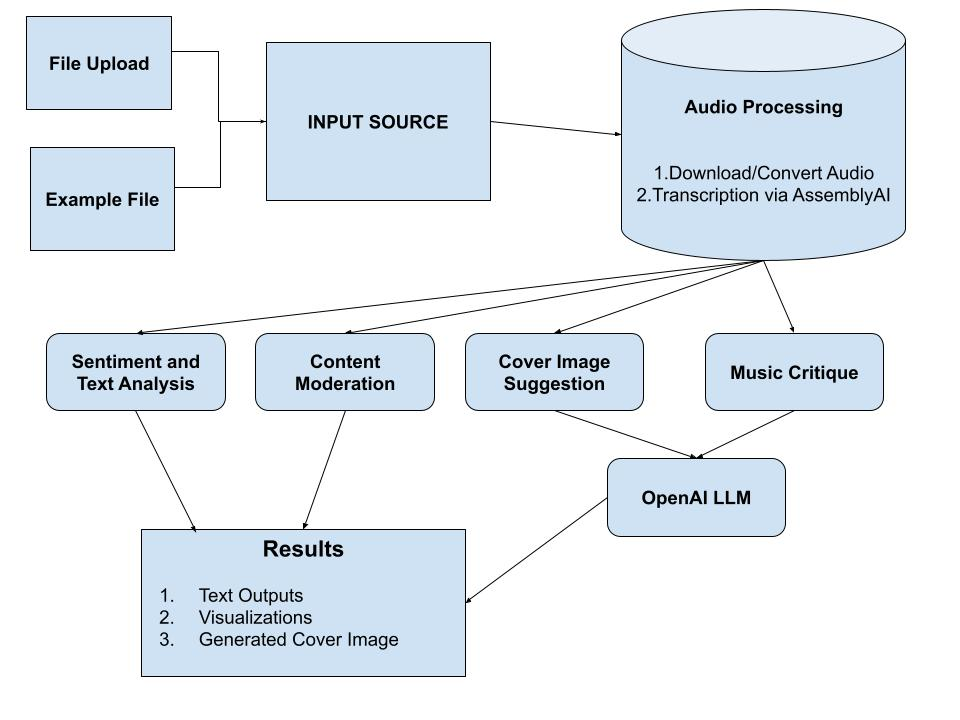

# MusicCritique

## Introduction

**MusicCritique** is a revolutionary application that harnesses the power of audio transcription and Language Model (LLM) technology to provide artists and music managers with valuable insights into their recorded songs. By offering data-driven understanding and analysis, MusicCritique empowers creators to make more informed and strategic decisions before releasing their musical masterpieces to the world.



## Features

The application provides the following features:

**MusicCritique** offers a range of powerful features to enhance your music creation and decision-making process:

- **Audio Transcription**: It automatically transcribes audio/video files of song recordings into text, making it easier to analyze and understand the lyrics and song structure.
- **Summarization**: It summarizes the song recording.
- **Sentiment Analysis**: It utilizes sentiment analysis to gain insights into the emotional tone of the song.
- **Lyrical Content Analysis**: It analyzes the lyrical content of the songs using visualizations to identify themes, keywords that can inform creative direction.
- **Content Moderation**: It detects and reports sensitive content in the song
- **Topic Detection**: It detects topics discussed in the song.
- **Criticism**: It performs a constructive critical analysis of the song based on essential factors.
- **Recommendations for Improvement**: It provides recommendations for improvements based on the obtained critical analysis.

## Get started

To get started with MusicCritique, follow these steps:

1. Clone the repository to your local machine:
    ```
    git clone https://github.com/your-username/your-repo.git
    ```

2. Navigate to the project directory:
    ```
    cd your-repo
    ```

3. Create a virtual environment and activate it:
    ```
    python -m venv venv
    source venv/bin/activate  # For Linux/Mac
    venv\Scripts\activate  # For Windows
    ```

4. Install the required dependencies from the `requirements.txt` file:
    ```
    pip install -r requirements.txt
    ```

5. Run the Streamlit app:
    ```
    streamlit run app/Music_Critique.py
    ```

6. Open your web browser and go to `http://localhost:8501` to access the MusicCritique application.

7. Use the application to upload your audio/video files and explore the various features it offers.

That's it! You are now ready to use MusicCritique with Streamlit. Enjoy analyzing and improving your music creations!
